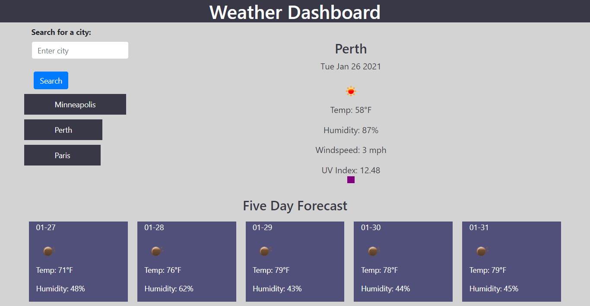

# Weather Dashboard

## Description 

A page that allows the user to input cities and recieve weather information about that city. Information is pulled from the API OpenWeatherMap.org 

Published at: https://litabeach.github.io/Weather-Dashboard/.

## Table of Contents

* [Usage](#usage)
* [Credits](#credits)
* [License](#license)

## Usage 

Enter a city into the search bar to view todays' weather and a five day forecast. 

## Credits

Michael Wilklow  
Hannah Folk  
openweathermap.org  
https://www.w3schools.com/ 

## Copyright

Copyright 2020 Lita Beach

Permission is hereby granted, free of charge, to any person obtaining a copy of this software and associated documentation files (the "Software"), to deal in the Software without restriction, including without limitation the rights to use, copy, modify, merge, publish, distribute, sublicense, and/or sell copies of the Software, and to permit persons to whom the Software is furnished to do so, subject to the following conditions:

The above copyright notice and this permission notice shall be included in all copies or substantial portions of the Software.

THE SOFTWARE IS PROVIDED "AS IS", WITHOUT WARRANTY OF ANY KIND, EXPRESS OR IMPLIED, INCLUDING BUT NOT LIMITED TO THE WARRANTIES OF MERCHANTABILITY, FITNESS FOR A PARTICULAR PURPOSE AND NONINFRINGEMENT. IN NO EVENT SHALL THE AUTHORS OR COPYRIGHT HOLDERS BE LIABLE FOR ANY CLAIM, DAMAGES OR OTHER LIABILITY, WHETHER IN AN ACTION OF CONTRACT, TORT OR OTHERWISE, ARISING FROM, OUT OF OR IN CONNECTION WITH THE SOFTWARE OR THE USE OR OTHER DEALINGS IN THE SOFTWARE.

## Badges

